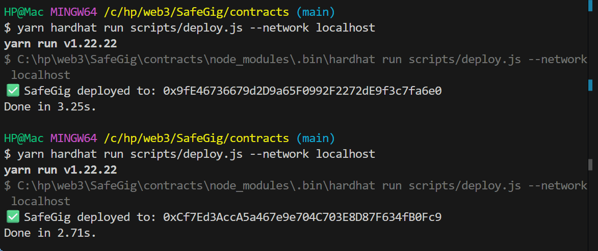

# SafeGig Smart Contract Setup (Local Development)

This guide explains how to set up and run the SafeGig smart contract project using Hardhat with a local development node.
It documents the steps we used for scaffolding, deploying, and interacting with the SafeGig contract.

## Project Structure

After setup, your project should look like this:
```bash
safegig/
├── contracts/
│   └── SafeGig.sol
├── scripts/
│   ├── deploy.js
├── hardhat.config.js
├── package.json
└── node_modules/
```

⚡ 1. Install Dependencies

We are using Yarn as the package manager. Install Hardhat and the required plugins:
```bash
yarn add --dev hardhat @nomicfoundation/hardhat-toolbox
```
### create the folders 
- mkdir contracts frontend docs
- cd contracts
- yarn init -y
- yarn add --dev hardhat

### Initialize Hardhat inside the project folder:
- yarn hardhat --init

### Add relevant dependencies
- yarn add --dev @nomicfoundation/hardhat-toolbox @openzeppelin/contracts dotenv

Choose "Create a JavaScript project" → accept defaults.
This sets up Hardhat with basic configuration.

⚡ 2. Start Local Hardhat Node

Run a local blockchain for development:
- npx hardhat node

This will start a local Ethereum JSON-RPC node at http://127.0.0.1:8545 and print out test accounts with private keys.

⚡ 3. Write the SafeGig Contract

Create contracts/SafeGig.sol with the following skeleton:

```bash
// SPDX-License-Identifier: MIT
pragma solidity ^0.8.20;
...
```


This is the basic contract to test deployment and interaction.

⚡ 4. Configure Hardhat for Local Deployment

Edit hardhat.config.js:
```bash
require("@nomicfoundation/hardhat-toolbox");

module.exports = {
  solidity: "0.8.20",
  networks: {
    hardhat: {},
    localhost: {
      url: "http://127.0.0.1:8545",
    },
  },
};

// Custom task to print accounts
task("accounts", "Prints the list of accounts", async (taskArgs, hre) => {
  const accounts = await hre.ethers.getSigners();

  for (const account of accounts) {
    console.log(account.address);
  }
});
```

⚡ 5. Deploy SafeGig Locally

Create scripts/deploy.js:
```bash
async function main() {
  const SafeGig = await ethers.getContractFactory("SafeGig");
  const safeGig = await SafeGig.deploy("First Gig on SafeGig!");
  await safeGig.deployed();

  console.log("SafeGig deployed to:", safeGig.address);
}

main()
  .then(() => process.exit(0))
  .catch((error) => {
    console.error(error);
    process.exit(1);
  });
```

Deploy the contract to the local node (make sure npx hardhat node is running in another terminal):

yarn hardhat run scripts/deploy.js --network localhost

You’ll see the deployed contract address printed.

⚡ 6. Interact with SafeGig

Create scripts/interact.js:
```bash
async function main() {
  const [deployer] = await ethers.getSigners();

  const SafeGig = await ethers.getContractFactory("SafeGig");
  const safeGig = await SafeGig.attach("YOUR_DEPLOYED_CONTRACT_ADDRESS");

  const gig = await safeGig.getGig();
  console.log("Gig name:", gig);

  console.log("Owner address:", await safeGig.owner());
}

main()
  .then(() => process.exit(0))
  .catch((error) => {
    console.error(error);
    process.exit(1);
  });
```

Run it:

yarn hardhat run scripts/interact.js --network localhost


You should see:

Gig name: First Gig on SafeGig!
Owner address: 0x1234... (your deployer address)

like so:


## Summary

- Installed Hardhat with Yarn

- Started local blockchain (npx hardhat node)

- Created SafeGig.sol smart contract

- Deployed to local network (deploy.js)

- Interacted with it using a script (interact.js)

This is the base foundation. From here, we can start building the actual SafeGig business logic (escrow, milestone payments, etc.).